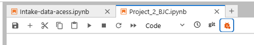
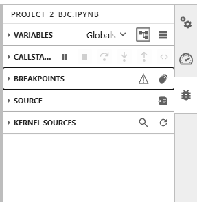
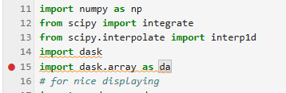
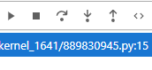

Using debugger
==============

When you can't figure out what's wrong with your code/why you get garbage results, you can try to use `debugger <https://jupyterlab.readthedocs.io/en/latest/user/debugger.html>`_ that is shipped with jupyterlab.

To turn it on, click on the debug switch in the top panel of your notebook.

Then, when you evaluate your cells, you can access the debuger throught the debug tab on the right.

Main feature of the debugger is the ability to use breakpoints. To add a break point click on the orange dot that appears when hovering your cursor to the left of the line number in the cell.
To remove a break point, just click on it. You will see all your breakpoints in the breakpoints panel of the debuger tab.

When you start running your notebook, the execution will stop at the breakpoint. You can examine variables, in the variables (local and global). Call-stack button provides you ability to continue execution step by step, step in the function, step out or execute code.

