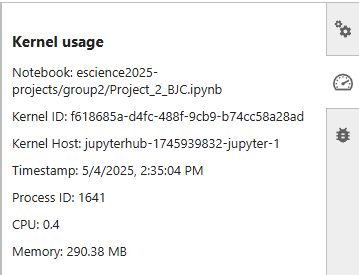
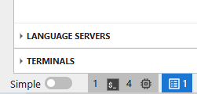
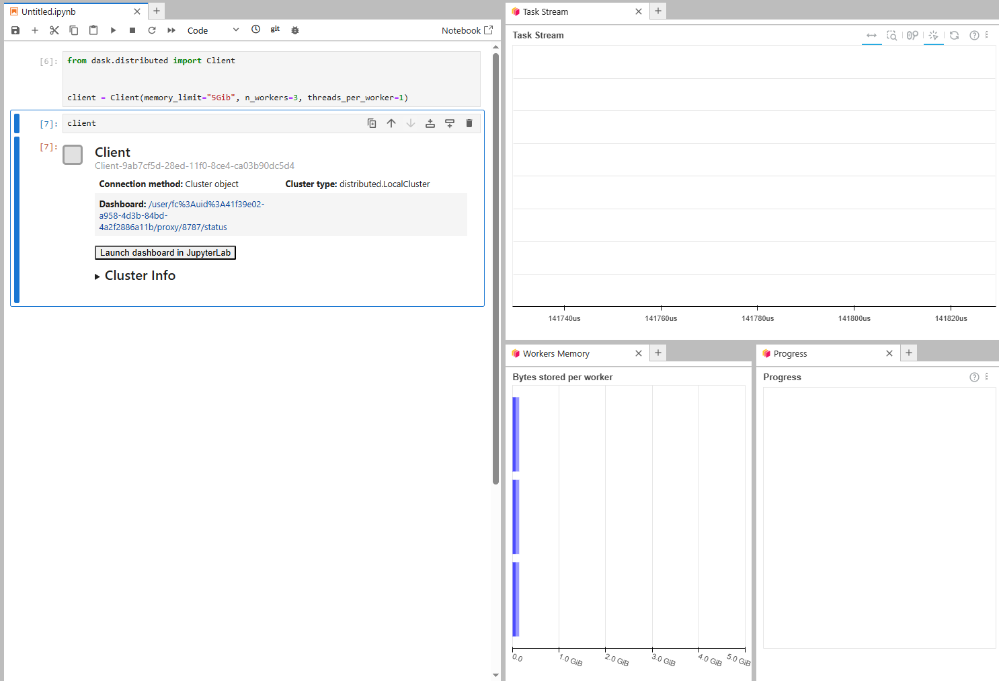

Monitoring resources
====================

Memory usage, kernels
---------------------

Most common issue you may encounter is the lack of memory for your jupyterlab instance. You can see the memory usage in the bottom of your window:

If your memory usage is too high (>16Gb), your notebook kernel will crash. To avoid that, consider splitting memory heavy tasks 
(f.e. you load daily data for 150 years and try to average it all at once). 
If your kernel crashes too often, consider saving interim results into a .nc or any other format.

Another common reason for your kernel to crash is too many asynchronous i/o requests (usually if you use xarray.open_mf_dataset). Consider reducing number of files you are loading at once to avoid crashes.

The overview of the resources you are using can be found in the right panel:

If you notice that you have stopped the kernel on one of your notebooks, but the memory-usage did not reduce, you can click on the resources button in the bottom left.

This button shows how many kernels, lsp's, terminals are currently running. If you click on it a tab will open where you can shut things down.

Dask
----

Another way to deal with that is to use Dask, and try to manage `memory usage <https://distributed.dask.org/en/stable/memory.html>`_.
When you start a dask client, you can monitor things by clicking on launch dashboard. You can also open the dashboard in a separate browser tab by clicking on it's adress.
Don't forget to use ``client.restart()`` and ``client.close()`` if things go wrong.

 
