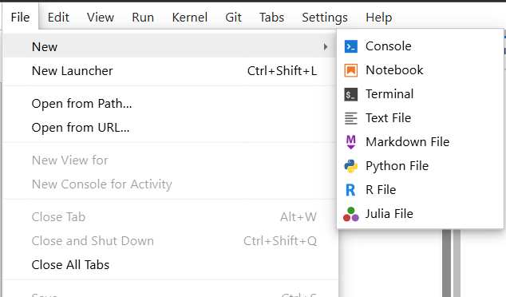

Using command terminal
===========================

You will most likely have to use terminal at some point. You can start it by either opening a launcher and scrolling down on throught the file menu:

.. image:: img/launcher.png
   :width: 500

Terminal is an application that allows user to use command-line interface (or shell) to interact with the operating system.

.. image:: img/terminal.png
   :width: 300

Our jupyterhub containers are based on linux, so in the terminal you will get the most common CLI for linux -- bash. 
To see what shell you are using type  type the following command ``echo $SHELL``. It literally means print out the value of environmental variable ``SHELL``.

.. code-block:: bash

    user@machine:~$ echo $SHELL
    /bin/bash 

Bash is both, language and a shell (like PowerShell in Windows), you can learn basics f.e. `here  <https://www.geeksforgeeks.org/bash-scripting-introduction-to-bash-and-bash-scripting>`_.

Navigating in terminal
----------------------

You have probably noticed that the promt you get in a terminal looks something like:

.. code-block:: bash

    notebook@jupyterhub-XXXXXXXXX-jupyter-X:~$

This basically means:

.. code-block:: bash

    username@host:current-directory$

To see the absolute path (these start with ``/``) of the current directory you are in, do ``pwd -P``. ``-P`` option prints the physical path, without any symbolic links. 

You can see the ``~`` in your prompt. This symbol tilde denotes your user home directory (as well as variable ``HOME``).

To see the contents of any directory, use ``ls <path>`` command (or just ``ls`` for the current directory). 
``ls`` has many options, most useful are:

    - ``-a`` -- show all the contents (including hidden files)
    - ``-l`` -- show contents as a list
    -  ``-t`` -- sort by time, newest first (by default the order is alphabetical)
    -  ``-r`` -- reverse order
    -  ``-h`` -- size of files in hubman-readable format (f.e. M for Mb, G for Gb etc)
    - ``--help`` -- print help for this command

To change your directory use ``cd <some-path>`` command. You can use absolute paths or relative. Relative path is a path relative to your current directory.

If you typed ``ls -a``, you might have noticed ``.`` and ``..`` in the output. ``.`` points to your current directory. ``..`` points to the one above (directory inside which your current directory is).
So, a realative path to somewhere in your current directory will look like: ``./some-directory/some-other-directory``. 

If you use ``cd`` without providing any path, you will get into your home (``~``). To go back to the directory you just came from, do -- ``cd -``.

In general, any command you can use in the shell has a ``--help`` option. Please, use it often, to see what the command does and what option it has. If you have some question about the command it is highly likely it is covered in ``--help``.

You can navigate between the commands you have already executed with up and down arrow keys. You can also search for a previous command by pressing ``Ctrl+R`` (for mac it might be ``cmd+R``, don't use mac). You will see ``(reverse-search)`` in your prompt. Start typing the command you want to search for, f.e.:

.. image:: img/reverse.png
   :width: 500

By pressing ``Ctrl-R`` again (and again) you can scroll up your history for instances of the command you've typed. To execute the command immediately press Enter, if you press Esc, command will not be executed but instead but your position in history will change. You can further scroll around with arrow keys.